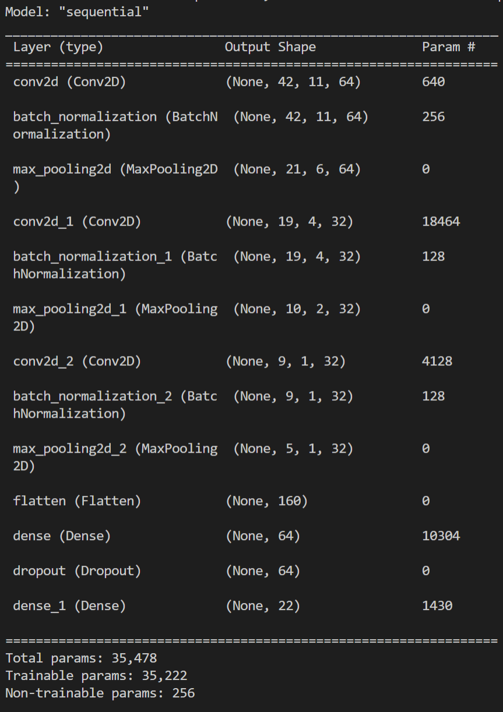
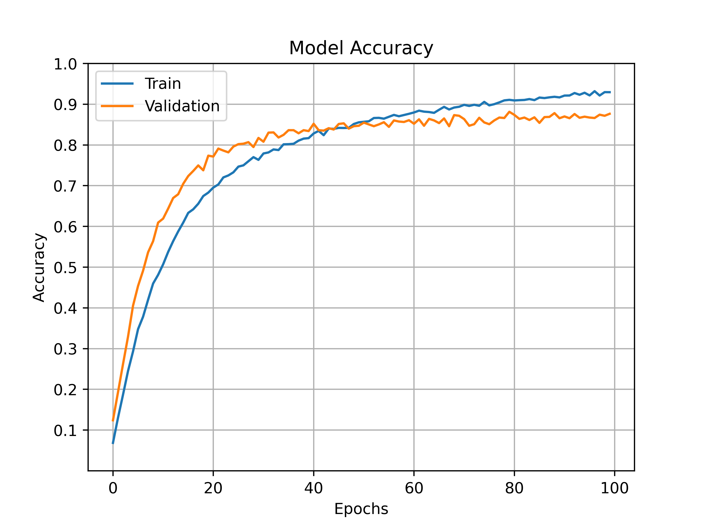
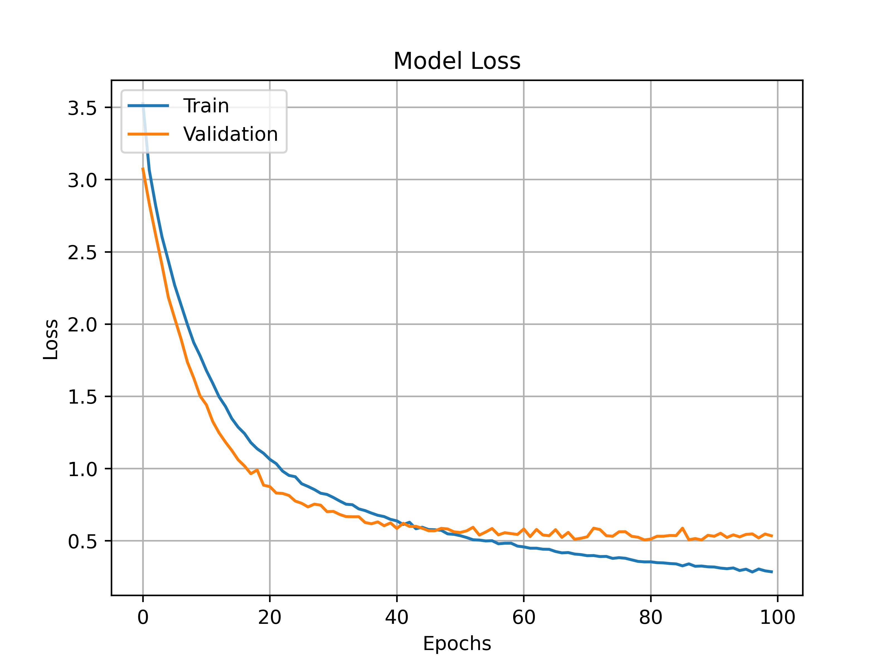

# Deployment of a Speech recognition system with TensorFlow in a Flask API
---
## **Description**
In this project, a Speech Recognition system is developed for predict words from audio files. In this case, the words that the system can detect are:

    "one", "two", "three", "four", "five", "six", "seven", "eight", "nine", "zero", 
    "up", "down", "left", "right", "go", "stop", "on", "off", "yes", "no", "cat", "dog"

In addition, such a system is deployed on a flask server to predict from a client scipt.

---
## **Model architecture**

---
## **Model accuracy and loss**

<table>
  <tr>
    <td></td>
    <td></td>
  </tr>
 </table>

---
### **Library Requirements**
    os
    librosa
    json
    numpy == 1.21
    scikitlearn
    tensorflow.keras
    matplotlib.pyplot
    flask
    random
    requests

--- 

### **Resources**
- **Deep Learning (Audio) application: From degign to deployment (V.Velardo):** https://www.youtube.com/playlist?list=PL-wATfeyAMNpCRQkKgtOZU_ykXc63oyzp
- **Google's Speech Commands Dataset:** https://ai.googleblog.com/2017/08/launching-speech-commands-dataset.html
    - Dataset: http://download.tensorflow.org/data/speech_commands_v0.01.tar.gz